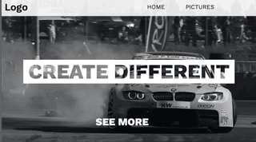
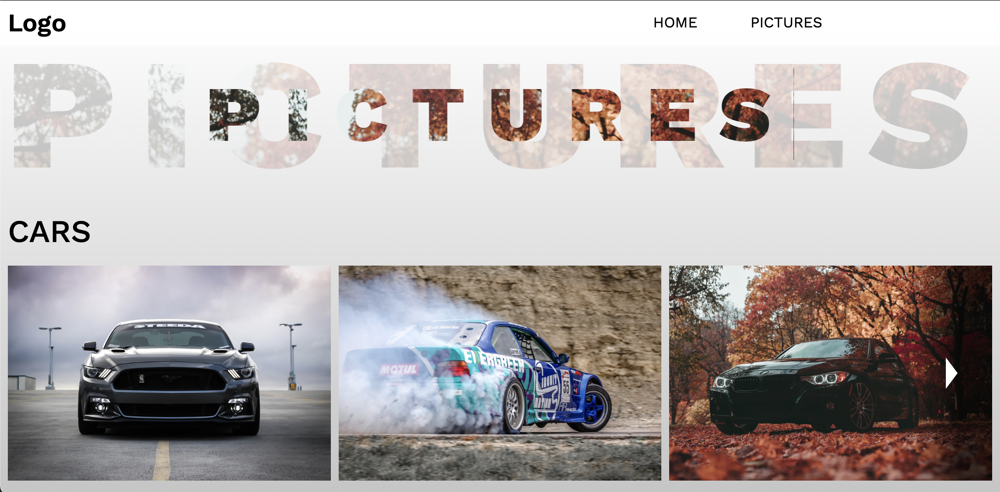

# Sample-Site-One
## Goal
- This site is meant to be a starter project to understand and improve the workflows in react and gatsby. 

## Result

## Learnings
- Sass modules
- Scss structuring & scope
- React props usage 
- Basic state usage
- Basic workflows & structures to start (and work in) a project

## Next Steps
- Get used to styled components
- Improve generic structure of components
- Improve State usage
- Expand component library
- Get used to animation libraries like React Spring